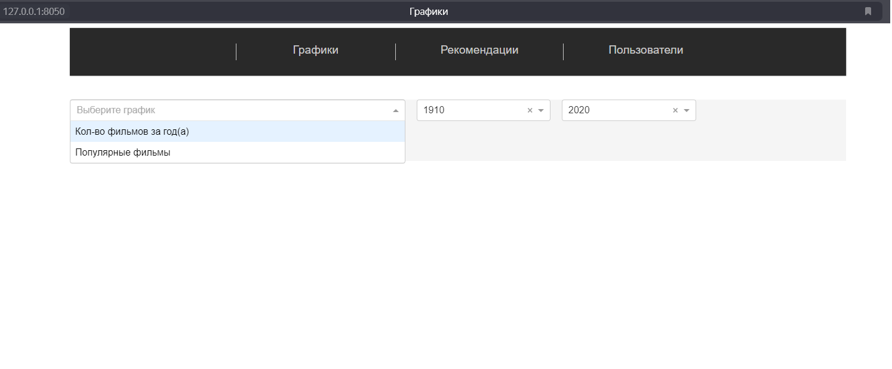
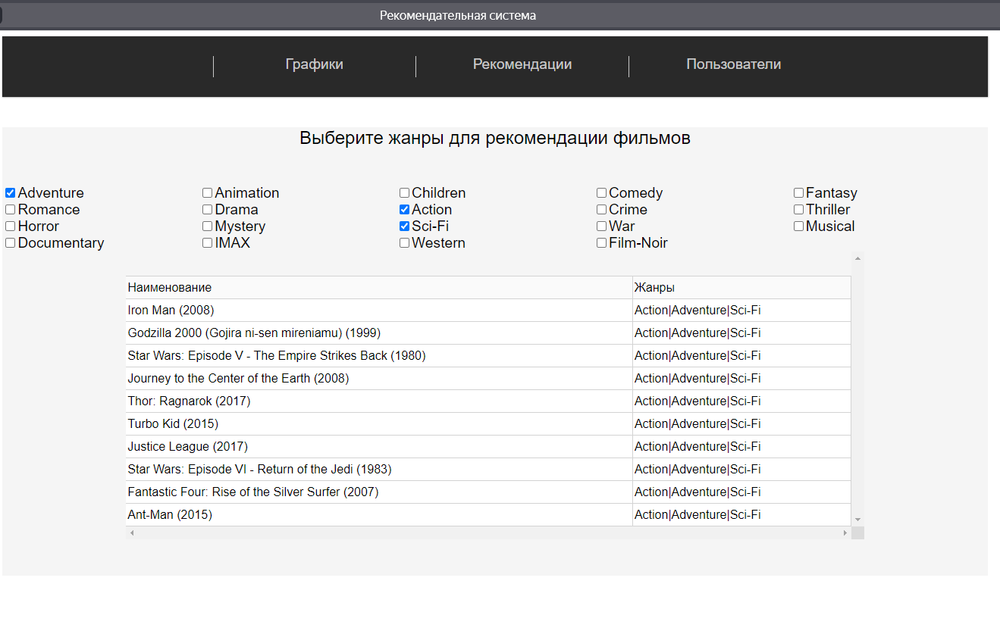
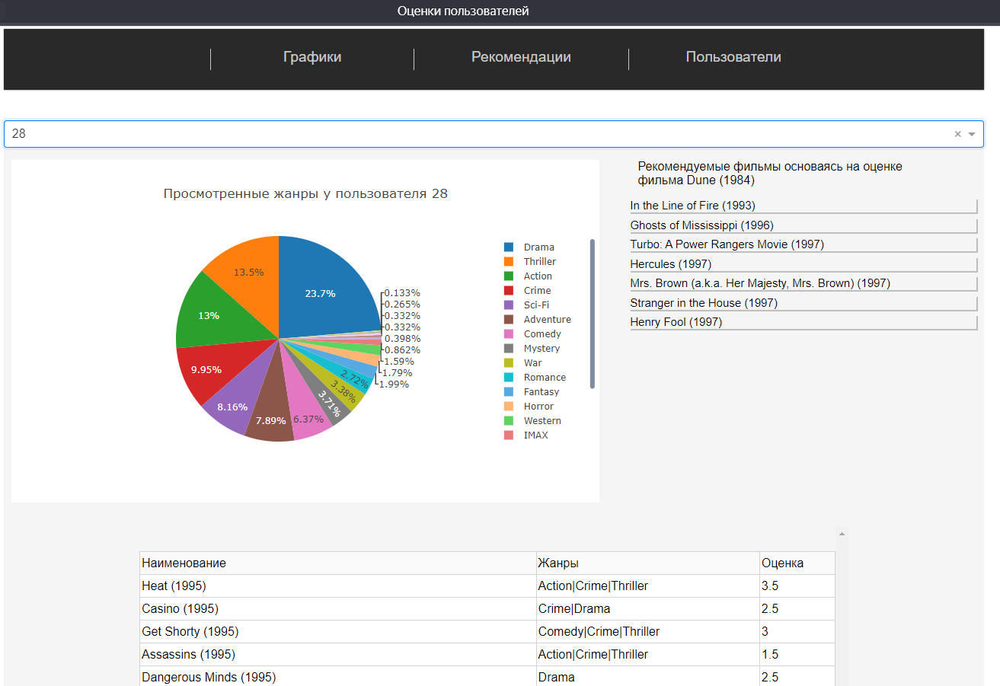
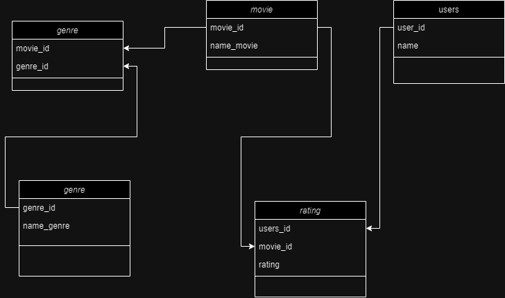

# Примитивная Рекомендательная Система

## 1. Описание проекта
```
Небольшой тестовый проект с веб-интерфейсом на реализацию примитивной рекомендательной системы на основе корреляции и косинусоидного сходства без использования глубоких нейросетей.
Представляющий три страницы
```
* 1. Отображение графиков.
    *    1.1 Кол-во фильмов за год-года (выбирается промежуток через выпадающие списки)ж.
    *    1.2 Популярные фильмы за год-года (по наивысшей оценке и их кол-ву).
* 2. Рекомендации.
    * 2.1 Вывод рекомендуемых фильмов по выбранным жанрам (через CheckBox)
* 3. Пользователи 
    * 3.1 Выбор пользователя через выпадающий список (Значения Id каждого пользователя из csv файла ratings.csv)
    * 3.2 При выборе пользователя показывает жанры оценённых проектов в виде круговой диаграммы
    * 3.3 Вывод оценённых фильмов в виде таблицы (Наименование|Жанр|Оценка)

## 2. Структура проекта

```
+--app
|  +--callback
|  |   +-- callback.py --> Файл с обратными вызовами для взаимодействия интерфейсом
|  |
|  +--models
|  |   +-- models.py --> Файл с моделями БД при использовании базы данных (На текущий момент только чтение из csv)
|  |
|  +--utils
|  |   +-- utils.py --> Файл с преодобработкой данных перед выводом их на веб-интерфейс
|  |
+--assets
|  +-- css
|  |   +-- main.css -> Файл с стилями для главной страницы
|  |   +-- recom.css -> Файл с стилями для страницы с рекомендациями по жанрам
|  |   +-- score.css -> Файл с стилями для страницы с пользователями
+--dataset
|  +-- movies.csv -> файл с фильмами
|  +-- ratings.csv -> файл с оценками пользователей
+-- pages
|  +-- plots.py -> файл страницы с графиками
|  +-- recomm_pages.py -> файл страницы с графиками
|  +-- user_score.py -> файл страницы с пользователями
+-- recomm_system.ipynb -> jupyter-notebook с наработками по примитивным реком. системам
|
+-- requiremets.txt -> файл с библиотеками
|
+-- run.py -> файл запускающий веб-интерфейс
```
## 3.Установка.


1. Клонируем или скачиваем проекта с гита 
2. Переходим в папку с проектом

3. Установка среды выполнения

    sudo python3 -m venv lenv

4. Установка библиотек и зависимостей

    Сначала активируем среду

    Переходим в консоль

    source lenv\bin\activate -- для linux

    lenv\Script\activate -- для Windows

5. Устанавливаем библиотеки след. командой

    sudo pip3 install -r requirements.txt -- linux

    sudo pip install -r requirements.txt -- Windows

## 4. Веб-интерфейс

1. Главная страница. "Графики"



2. Страница рекомендации



3. Страница Пользователи



## 5. Развитие


1. Перенести запуск на докер контейнер
2. Использовать базу данных для хранение данных.
3. Автоматический создание и запуск веб-сервиса через bash скрипт

## 6. База данных.

```
В проекте планируется дальнейшее доабвление Базы данных со след. структурой, как один из вариантов
```


### Версия проекта

V. 1.0
